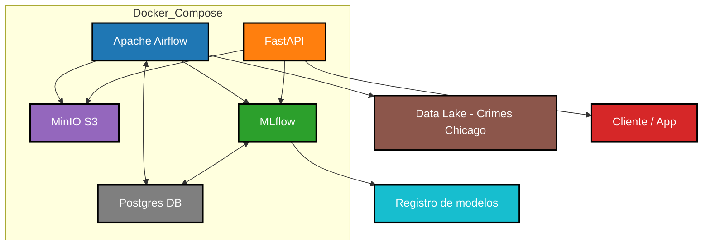
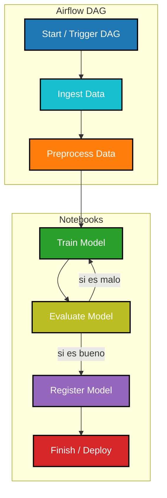

# CEIA_2025_B3_MLOps1_TP

Curso de Especialización en Inteligencia Artificial  
Año 2025  
Bimestre 3  

## Materia: Operaciones de Aprendizaje Automático 1  

## Docente:
* Facundo Lucianna

## Integrantes:
* Mendoza Dante
* Viñas Gustavo


## Iniciar servicios

```bash
docker compose --profile all up
```

   - Apache Airflow: http://localhost:8080
   - MLflow: http://localhost:5001
   - MinIO: http://localhost:9001 (ventana de administración de Buckets)
   - API: http://localhost:8800/
   - Documentación de la API: http://localhost:8800/docs

## Apagar los servicios

Detener los servicios:

```bash
docker compose --profile all down
```

Detener los servicios y eliminar toda la infraestructura (liberando espacio en disco):

```bash
docker compose --profile all down --rmi all --volumes
```
Nota: Si haces esto, perderás todo en los buckets y bases de datos.

# Descripción del proyecto

Al iniciar los servicios por primera vez, tendremos el ambiente totalmente vacío.  

Para comenzar, debemos ejecutar en Airflow el DAG/ETL (o establecer algún criterio de ejecución automática). Esto cargará los datos de crímenes de Chicago en nuestro bucket "data" de S3 en la ruta "chicago/crimes/2024", registrando en MLFlow el proceso dentro del experimento "Chicago Crimes 2024".  
Dentro del bucket, se guarda el dataset original, el de columnas preprocesadas (sin transformación aun) y los sets de train y test, separados en features y target. Este último ubicado en una subcarpeta "final".
También se guarda información de las columnas (preprocesadas) y el pipeline para transformación de las mismas. Esta información se encuentra en el mismo bucket, en la ruta "/chicago/crimes/data_info".

Una vez cargados los datos, podremos realizar el entrenamiento de nuestros modelos a través de 2 notebooks.  
Utilizaremos 2 modelos creados en la materia Aprendizaje de Máquina.  
Uno de ellos, Decision Tree Classifier, con búsqueda de hiperparámetros mediante optuna, disponible en la notebook notebook_example\experiment_DTC.ipynb.  
El otro, un modelo sencillo de Linear Discriminant Analysis, disponible en la notebook notebook_example\experiment_LDA.ipynb.

Los requisitos para la ejecución de las notebooks se encuentran en "notebook_example\requirements.txt" o como proyecto de uv en "notebook_example\pyproject.toml"

Al ejecutar cada una de las notebooks, el proceso descargará los archivos de entrenamiento, entrenará el modelo y calculará las métricas contra el set de test. Toda esta información se guardará en MLFlow en el experimento llamado "Chicago Crimes 2024".  
También se registrarán los modelos productivos, que será utilizado en la API para predecir.  

La API, implementada mediante FastAPI, recibe un POST en el endpoint /predict, con las features como datos.  
Este endpoint internamente realiza la validación y transformación de variables, y luego aplica los modelos obtenidos desde MLFlow (con posibilidad de usar una versión embebida local en caso de no poder conectarse). Como resultado obtenemos la predicción realizada con ambos modelos.  

Ejemplo de llamada al endpoint:
```
curl -X 'POST' \
  'http://localhost:8800/predict/' \
  -H 'accept: application/json' \
  -H 'Content-Type: application/json' \
  -d '{
  "features": {
    "arrest": false,
    "beat": 412,
    "community_area": 46,
    "description": "THEFT / RECOVERY - AUTOMOBILE",
    "dia_mes": 4,
    "dia_semana": 1,
    "district": 4,
    "domestic": false,
    "hora": 5,
    "iucr": "0930",
    "latitude": 41.743747398,
    "location_description": "STREET",
    "longitude": -87.566115082,
    "mes": 6,
    "primary_type": "MOTOR VEHICLE THEFT",
    "ward": 7
  }
}'
```

Respuesta esperada:
```
{"dtc_fbi_code_output":"07","lda_fbi_code_output":"07"}
```

Se puede consultar la documentación de la API en http://localhost:8800/docs

### Datos de prueba
Se pueden encontrar datos para probar el endpoint de la API en la notebook "notebook_example\samples.ipynb".  
Esta notebook cargará el dataset de columnas preprocesadas (sin transformación) y mostrará un registro de este dataset, junto al valor esperado (target).  
También contiene un ejemplo con uso de redis como cache intermedia, donde la predicción se busca primero en redis y de no encontrarse se invoca la API para generarla.

## Nota
El proyecto realizó en Windows 11, aunque también fue probado en Ubuntu 24, sin encontrar inconvenientes a la hora de su ejecución (sin necesidad de cambiar el AIRFLOW_UID).  
Igualmente se recomienda su ejecución en Windows 11, ante la posibilidad de problemas de compatibilidad desconocidos en otros entornos.

## 📌 Arquitectura general del sistema


## 📌 Ciclo de vida del modelo

```mermaid
flowchart LR
    A["Data Lake - Crimes Chicago"] --> B["Airflow ETL"]
    B <--> C["MinIO (Almacenamiento)"]
    C --> D["Train/Test Split"]
    D --> E["Entrenamiento (Notebook/Script)"]
    E --> F["MLflow Tracking"]
    F --> G["MLflow Registro de Modelos"]
    G --> H["FastAPI Predicción"]
    H --> I["Predicción al usuario"]

    %% Integración con Postgres
    F <---> J["Postgres (Metadatos MLflow)"]

    %% Estilos
    style A fill:#8c564b,stroke:#000,stroke-width:2px,color:#fff
    style B fill:#1f77b4,stroke:#000,stroke-width:2px,color:#fff
    style C fill:#9467bd,stroke:#000,stroke-width:2px,color:#fff
    style D fill:#2ca02c,stroke:#000,stroke-width:2px,color:#fff
    style E fill:#bcbd22,stroke:#000,stroke-width:2px,color:#fff
    style F fill:#2ca02c,stroke:#000,stroke-width:2px,color:#fff
    style G fill:#17becf,stroke:#000,stroke-width:2px,color:#fff
    style H fill:#ff7f0e,stroke:#000,stroke-width:2px,color:#fff
    style I fill:#d62728,stroke:#000,stroke-width:2px,color:#fff
    style J fill:#7f7f7f,stroke:#000,stroke-width:2px,color:#fff
```


## 📌 Pipeline dentro de Airflow (DAG)

